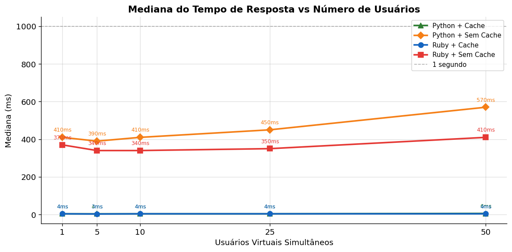
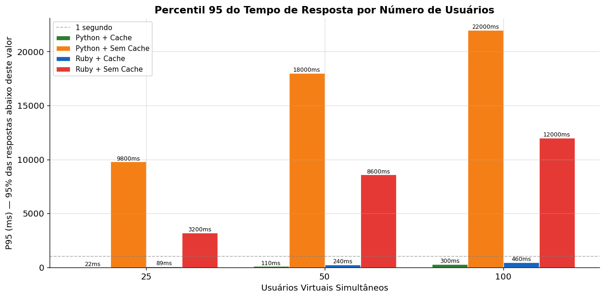
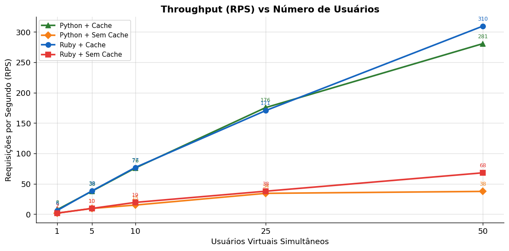
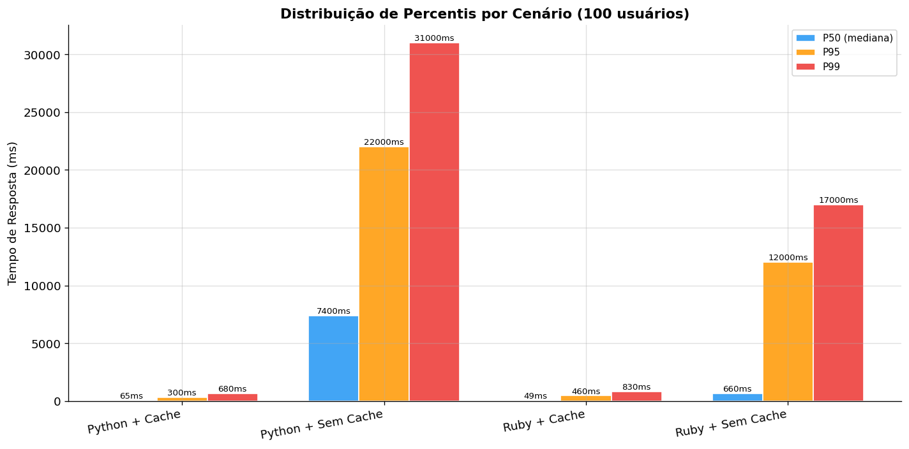

````md
# Trabalho 4 — Testes de Desempenho com Link Extractor

Este repositório contém uma versão da aplicação Link Extractor preparada para comparar o desempenho da API implementada em Ruby e em Python, executando os dois cenários com cache e sem cache.

Os testes foram realizados com Locust, e os resultados foram exportados em arquivos CSV dentro da pasta `resultados/`.

A aplicação possui:

- uma interface web em PHP;
- uma API que recebe uma URL no endpoint `/api/<url>`;
- extração de links da página informada;
- retorno em JSON contendo o texto e o endereço de cada link encontrado.

---

# Sumário

- [Estrutura do Projeto](#estrutura-do-projeto)
- [Requisitos](#requisitos)
- [Arquitetura Geral](#arquitetura-geral)
- [Metodologia dos Testes](#metodologia-dos-testes)
- [Execução dos Cenários](#execução-dos-cenários)
  - [Ruby com Cache](#ruby-com-cache)
  - [Ruby sem Cache](#ruby-sem-cache)
  - [Python com Cache](#python-com-cache)
  - [Python sem Cache](#python-sem-cache)
- [Gráficos Gerados](#gráficos-gerados)
- [Arquivos de Resultados](#arquivos-de-resultados)

---

# Estrutura do Projeto

```text
.
├── api/
├── api-python/
├── www/
├── resultados/
├── locustfile.py
├── docker-compose.yml
├── docker-compose-ruby-no-cache.yml
├── docker-compose-python.yml
└── docker-compose-python-no-cache.yml
````

Descrição das pastas e arquivos principais:

* `api/`: implementação da API em Ruby utilizando Sinatra, Nokogiri e Redis.
* `api-python/`: implementação da API em Python utilizando Flask, BeautifulSoup e Redis.
* `www/`: interface web em PHP.
* `locustfile.py`: script utilizado para execução dos testes de carga.
* `resultados/`: arquivos CSV gerados pelo Locust e gráficos em PNG.
* `docker-compose.yml`: execução da API Ruby com cache.
* `docker-compose-ruby-no-cache.yml`: execução da API Ruby sem cache.
* `docker-compose-python.yml`: execução da API Python com cache.
* `docker-compose-python-no-cache.yml`: execução da API Python sem cache.

---

# Requisitos

Para executar o projeto e reproduzir os testes são necessários:

* Docker;
* Docker Compose;
* Python 3.x;
* Locust instalado no ambiente.

Instalação do Locust:

```bash
pip install locust
```

---

# Arquitetura Geral

A arquitetura utilizada nos testes pode ser representada da seguinte forma:

```text
Locust
   │
   ▼
API Ruby / API Python
   │
   ├── Extração de links
   │
   └── Redis (quando cache habilitado)
```

Fluxo geral da aplicação:

1. O cliente realiza uma requisição para `/api/<url>`.
2. A API processa a URL recebida.
3. A página é baixada e analisada.
4. Os links encontrados são extraídos.
5. A resposta JSON é retornada ao cliente.
6. Nos cenários com cache, os resultados são armazenados no Redis.

---

# Metodologia dos Testes

Os testes de desempenho foram executados com Locust utilizando o arquivo `locustfile.py`.

O usuário virtual definido nesse arquivo acessa sequencialmente 10 URLs públicas e estáveis, sempre chamando o endpoint da API no formato:

```text
/api/<url>
```

Foram coletados resultados para:

* 1 usuário simultâneo;
* 5 usuários simultâneos;
* 10 usuários simultâneos;
* 25 usuários simultâneos;
* 50 usuários simultâneos.

Os testes foram realizados em quatro cenários:

* Ruby com cache;
* Ruby sem cache;
* Python com cache;
* Python sem cache.

Exemplo de execução em modo headless:

```bash
locust -f locustfile.py \
  --host http://localhost:4567 \
  --users 10 \
  --spawn-rate 2 \
  --run-time 60s \
  --headless \
  --csv resultados/ruby_cache_10u
```

Hosts utilizados:

* API Ruby: `http://localhost:4567`
* API Python: `http://localhost:5000`

---

# Execução dos Cenários

## Ruby com Cache

O cenário Ruby com cache é executado pelo arquivo:

```text
docker-compose.yml
```

Nesse modo:

* o serviço `api` é construído a partir da pasta `api/`;
* a porta `4567` é exposta;
* a variável de ambiente `REDIS_URL=redis://redis:6379` é utilizada.

O mesmo compose sobe um container `redis`, utilizado pela API Ruby para armazenar os resultados da extração de links.

Na implementação em `api/linkextractor.rb`, o cache permanece ativo por padrão, pois a variável `USE_CACHE` possui valor padrão `"true"`.

### Fluxo implementado

1. A API recebe uma requisição em `/api/<url>`.
2. A URL recebida é utilizada como chave no Redis.
3. Caso o resultado exista no Redis, ocorre um *cache hit* e o JSON armazenado é retornado.
4. Caso não exista, ocorre um *cache miss*:

   * a página é baixada com `open-uri`;
   * os links são extraídos com `Nokogiri`;
   * o JSON é salvo no Redis;
   * a resposta é retornada ao cliente.
5. O arquivo `logs/extraction.log` registra:

   * timestamp;
   * status do cache;
   * URL consultada.

### Execução

```bash
docker compose -f docker-compose.yml up --build
```

---

## Ruby sem Cache

O cenário Ruby sem cache é executado pelo arquivo:

```text
docker-compose-ruby-no-cache.yml
```

Nesse modo:

* a mesma implementação Ruby da pasta `api/` é utilizada;
* a variável `USE_CACHE=false` é definida;
* o serviço Redis não é iniciado.

Com isso:

* a variável `use_cache` em `api/linkextractor.rb` torna-se falsa;
* a API registra inicialização sem cache;
* todas as requisições utilizam status `BYPASS` no log.

### Fluxo implementado

1. A API recebe uma requisição em `/api/<url>`.
2. Nenhuma consulta ao Redis é realizada.
3. A página é sempre baixada novamente.
4. Os links são extraídos com `Nokogiri`.
5. A resposta JSON é gerada e retornada diretamente.
6. O arquivo `logs/extraction.log` registra a requisição com status `BYPASS`.

### Execução

```bash
docker compose -f docker-compose-ruby-no-cache.yml up --build
```

---

## Python com Cache

O cenário Python com cache é executado pelo arquivo:

```text
docker-compose-python.yml
```

Nesse modo:

* o serviço `api` é construído a partir da pasta `api-python/`;
* a porta `5000` é exposta;
* as variáveis:

  * `REDIS_URL=redis://redis:6379`
  * `USE_CACHE=true`
    são utilizadas.

O compose também sobe um container `redis`.

Na implementação em `api-python/linkextractor.py`:

* a API utiliza `redis.StrictRedis.from_url()`;
* a conexão é validada com `ping()`.

Caso o Redis esteja indisponível, o cache é desativado automaticamente.

### Fluxo implementado

1. A API recebe uma requisição em `/api/<url>`.
2. Se o cache estiver ativo, a URL é consultada no Redis.
3. Caso exista valor armazenado, o JSON é retornado diretamente.
4. Caso não exista:

   * a página é baixada com `urllib.request`;
   * os links são extraídos com `BeautifulSoup`;
   * o parser `lxml` é utilizado;
   * o JSON é salvo no Redis;
   * a resposta é retornada ao cliente.

### Execução

```bash
docker compose -f docker-compose-python.yml up --build
```

---

## Python sem Cache

O cenário Python sem cache é executado pelo arquivo:

```text
docker-compose-python-no-cache.yml
```

Nesse modo:

* a mesma implementação da pasta `api-python/` é utilizada;
* `USE_CACHE=false` é definido;
* o serviço Redis não é iniciado.

Com essa configuração:

* `api-python/linkextractor.py` inicia sem cache;
* cada requisição executa novamente todo o processo de download e extração.

### Fluxo implementado

1. A API recebe uma requisição em `/api/<url>`.
2. Nenhuma consulta ao Redis é realizada.
3. A página é baixada com `urllib.request`.
4. Um `User-Agent` é definido na requisição.
5. Os links são processados com `BeautifulSoup`.
6. A resposta JSON é retornada sem armazenamento em cache.

### Execução

```bash
docker compose -f docker-compose-python-no-cache.yml up --build
```

---

# Gráficos Gerados

Os gráficos abaixo foram gerados a partir dos arquivos CSV presentes em `resultados/` e resumem as principais métricas dos testes.

## Gráfico 1 — Mediana do Tempo de Resposta



---

## Gráfico 2 — Percentil 95 do Tempo de Resposta



---

## Gráfico 3 — Requisições por Segundo



---

## Gráfico 4 — Comparação de Percentis



---

# Arquivos de Resultados

Para cada combinação de:

* linguagem;
* uso de cache;
* quantidade de usuários;

o Locust gerou arquivos no seguinte formato:

* `*_stats.csv`: resumo estatístico da execução;
* `*_stats_history.csv`: histórico das métricas durante o teste;
* `*_failures.csv`: falhas registradas;
* `*_exceptions.csv`: exceções registradas.

Os arquivos seguem o padrão:

```text
linguagem_cache_usuarios
```

Exemplos:

```text
ruby_cache_10u_stats.csv
ruby_nocache_25u_stats.csv
python_cache_50u_stats.csv
python_nocache_1u_stats.csv
```

```
```
