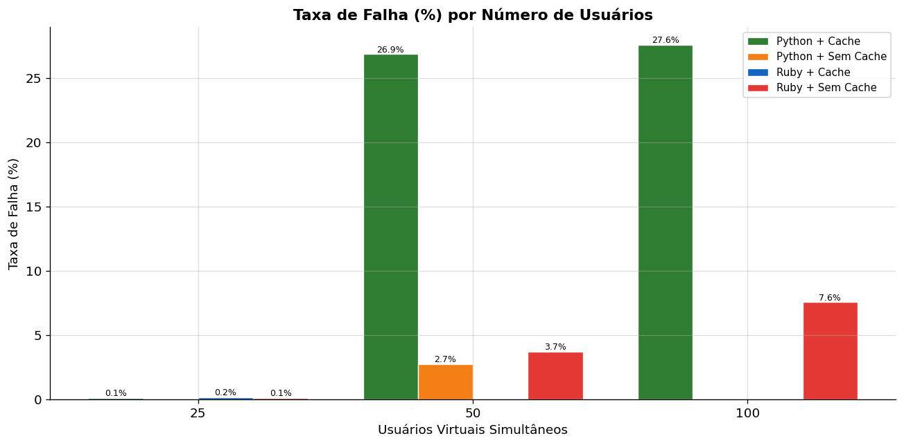

# Trabalho 4 - Testes de Desempenho com Link Extractor

Alunos: Icaro Mota, Mateus Maia e Nelson Mateus

Este trabalho compara o desempenho da aplicacao Link Extractor em quatro cenarios: API Ruby com cache, API Ruby sem cache, API Python com cache e API Python sem cache. Os testes foram executados com Locust, os dados foram salvos em CSV na pasta `resultados/` e os graficos finais foram gerados em PNG.

A aplicacao recebe uma URL no endpoint `/api/<url>`, baixa a pagina informada, extrai os links encontrados e devolve uma resposta JSON contendo o texto e o endereco de cada link.

## Estrutura do projeto

- `api/`: API Ruby implementada com Sinatra, Nokogiri e Redis.
- `api-python/`: API Python implementada com Flask, BeautifulSoup, lxml e Redis.
- `www/`: interface web em PHP.
- `locustfile.py`: script de teste de carga usado pelo Locust.
- `resultados/`: arquivos CSV dos testes e graficos PNG gerados.
- `docker-compose.yml`: Ruby com cache.
- `docker-compose-ruby-no-cache.yml`: Ruby sem cache.
- `docker-compose-python.yml`: Python com cache.
- `docker-compose-python-no-cache.yml`: Python sem cache.
- `comandos_graficos_barras.ipynb`: notebook usado para trabalhar os resultados e gerar os graficos.

## Como os testes foram feitos

Os testes foram feitos com o Locust usando o arquivo `locustfile.py`. O usuario virtual percorre uma lista de 10 URLs publicas, codifica cada URL com `quote(url, safe="")` e faz requisicoes para `/api/<url_codificada>`.

As URLs usadas incluem paginas mais pesadas e com muitos links, como Wikipedia, httpbin com 1000 links, GitHub, arXiv, WordPress plugins, Hacker News e IANA. Isso aumenta o trabalho de download, parsing HTML e extracao de links, deixando a comparacao entre cache e sem cache mais evidente.

## URLs usadas nos testes

A tabela abaixo mostra as 10 URLs usadas no teste de carga e a quantidade de links encontrados em cada pagina durante a extracao.

| Quantidade de links | URL |
|---:|---|
| 393 | https://en.wikipedia.org/wiki/Special:AllPages |
| 199 | https://httpbin.org/links/1000/1 |
| 415 | https://crawler-test.com |
| 215 | https://github.com/apache |
| 635 | https://arxiv.org/list/cs/recent |
| 262 | https://linuxtracker.org/ |
| 101 | https://wordpress.org/plugins/ |
| 226 | https://news.ycombinator.com/news?p=1 |
| 825 | https://en.wikipedia.org/wiki/Index_of_computing_articles |
| 65 | https://www.iana.org/domains/reserved |

Essas paginas foram escolhidas porque possuem diferentes tamanhos e estruturas HTML, permitindo testar melhor o custo de download, parsing e extracao de links nas APIs Ruby e Python, tanto com cache quanto sem cache.

Foram gerados resultados para 25, 50 e 100 usuarios simultaneos em cada um dos quatro cenarios:

- Ruby com cache.
- Ruby sem cache.
- Python com cache.
- Python sem cache.

Exemplo de execucao em modo headless para a API Ruby:

```bash
locust -f locustfile.py \
  --host http://localhost:4567 \
  --users 50 \
  --spawn-rate 2 \
  --run-time 60s \
  --headless \
  --csv resultados/ruby_cache_50u
```

Para testar Ruby, o host usado e `http://localhost:4567`. Para testar Python, o host usado e `http://localhost:5000`.

## Graficos gerados

Todos os graficos PNG gerados pelo trabalho estao abaixo.

### Grafico 1 - Mediana do tempo de resposta


### Grafico 2 - Percentil 95 do tempo de resposta


### Grafico 3 - Requisicoes por segundo


### Grafico 4 - Comparacao de percentis


### Grafico 5 - Taxa de falha



## Ruby com cache

O cenario Ruby com cache usa o arquivo `docker-compose.yml`. Nele, o servico `api` e construido a partir da pasta `api/`, expoe a porta `4567` e recebe `REDIS_URL=redis://redis:6379`. O mesmo compose tambem cria o servico `redis`, responsavel por armazenar as respostas da API.

Na implementacao `api/linkextractor.rb`, o cache fica ativo por padrao porque `USE_CACHE` e lido com valor padrao `"true"`:

```ruby
use_cache = ENV.fetch("USE_CACHE", "true") == "true"
```

Quando o cache esta ativo, a API cria uma conexao com Redis usando a URL definida em `REDIS_URL`. Para cada requisicao em `/api/*`, a URL recebida e usada como chave no Redis.

Fluxo implementado:

1. A API recebe a URL pelo endpoint `/api/*`.
2. O codigo monta a URL final juntando o caminho recebido e a query string.
3. A API consulta o Redis usando a URL como chave.
4. Se existir valor salvo, ocorre `HIT` e o JSON em cache e retornado.
5. Se nao existir valor salvo, ocorre `MISS`, a pagina e baixada com `open-uri`, os links sao extraidos com `Nokogiri` e o JSON e salvo no Redis.
6. A requisicao e registrada em `logs/extraction.log` com timestamp, status do cache e URL.

Para executar:

```bash
docker compose -f docker-compose.yml up --build
```

## Ruby sem cache

O cenario Ruby sem cache usa o arquivo `docker-compose-ruby-no-cache.yml`. Ele utiliza a mesma API Ruby da pasta `api/`, mas define a variavel `USE_CACHE=false` e nao sobe o container Redis.

Com `USE_CACHE=false`, a variavel `use_cache` fica falsa em `api/linkextractor.rb`. Nesse modo, a API nao consulta nem grava dados no Redis. O status registrado no log passa a ser `BYPASS`, indicando que o cache foi ignorado.

Fluxo implementado:

1. A API recebe a URL pelo endpoint `/api/*`.
2. A consulta ao Redis nao e feita.
3. A pagina e baixada novamente em toda requisicao.
4. Os links sao extraidos com `Nokogiri`.
5. O JSON e gerado e retornado diretamente.
6. A requisicao e registrada em `logs/extraction.log` com status `BYPASS`.

Para executar:

```bash
docker compose -f docker-compose-ruby-no-cache.yml up --build
```

## Python com cache

O cenario Python com cache usa o arquivo `docker-compose-python.yml`. Nele, o servico `api` e construido a partir da pasta `api-python/`, expoe a porta `5000` e recebe `REDIS_URL=redis://redis:6379` e `USE_CACHE=true`. O compose tambem sobe um container `redis`.

Na implementacao `api-python/linkextractor.py`, a variavel `USE_CACHE` e lida do ambiente. Quando ela esta ativa, a API tenta criar um cliente Redis com `redis.StrictRedis.from_url()` e valida a conexao com `ping()`. Se a conexao falhar, o codigo desativa o cache automaticamente para manter a API funcionando.

Fluxo implementado:

1. A API recebe a URL pelo endpoint `/api/<path:url>`.
2. Se `USE_CACHE` estiver ativo e houver cliente Redis, a API consulta o Redis usando a URL como chave.
3. Se existir valor salvo, o JSON armazenado e retornado diretamente.
4. Se nao existir valor salvo, a pagina e baixada com `urllib.request`.
5. O HTML e processado com `BeautifulSoup` usando o parser `lxml`.
6. Os links encontrados sao convertidos para URLs absolutas com `urljoin`.
7. O JSON final e salvo no Redis e retornado ao cliente.

Para executar:

```bash
docker compose -f docker-compose-python.yml up --build
```

## Python sem cache

O cenario Python sem cache usa o arquivo `docker-compose-python-no-cache.yml`. Ele utiliza a mesma API da pasta `api-python/`, mas define `USE_CACHE=false` e nao cria o servico Redis.

Com essa configuracao, `api-python/linkextractor.py` inicia em modo sem cache. A API nao consulta Redis e nao armazena as respostas, entao cada requisicao executa novamente o download da pagina, o parsing do HTML e a extracao dos links.

Fluxo implementado:

1. A API recebe a URL pelo endpoint `/api/<path:url>`.
2. Nenhuma consulta ao Redis e feita.
3. A pagina e baixada com `urllib.request`, usando um `User-Agent` definido no codigo.
4. O HTML e processado com `BeautifulSoup` e `lxml`.
5. Os links sao convertidos com `urljoin`.
6. O JSON e retornado sem ser salvo em cache.

Para executar:

```bash
docker compose -f docker-compose-python-no-cache.yml up --build
```

## Arquivos de resultados

Os arquivos gerados pelo Locust ficam em `resultados/`. Para cada combinacao de linguagem, uso de cache e quantidade de usuarios, existem arquivos com estes sufixos:

- `*_stats.csv`: resumo estatistico da execucao.
- `*_stats_history.csv`: historico das metricas durante o teste.
- `*_failures.csv`: falhas registradas.
- `*_exceptions.csv`: excecoes registradas.

Exemplos de nomes gerados:

- `ruby_cache_25u_stats.csv`
- `ruby_nocache_50u_stats.csv`
- `ruby_cache_100u_stats.csv`
- `python_cache_25u_stats.csv`
- `python_nocache_50u_stats.csv`
- `python_cache_100u_stats.csv`

Esses CSVs foram usados para montar os graficos de mediana, percentil 95, requisicoes por segundo, comparacao de percentis e taxa de falha.
